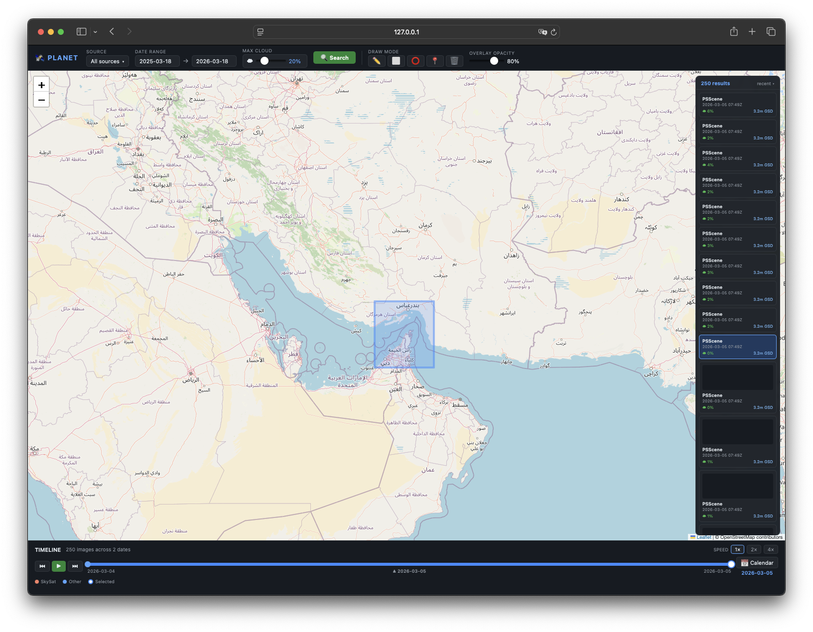
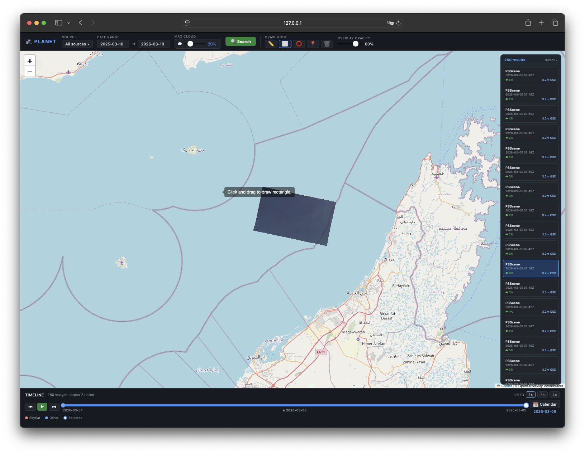
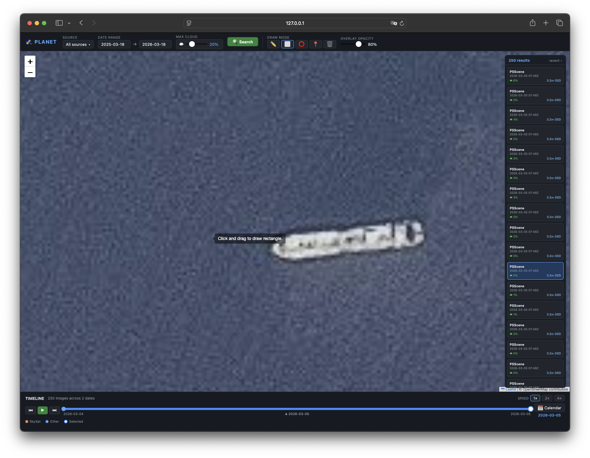
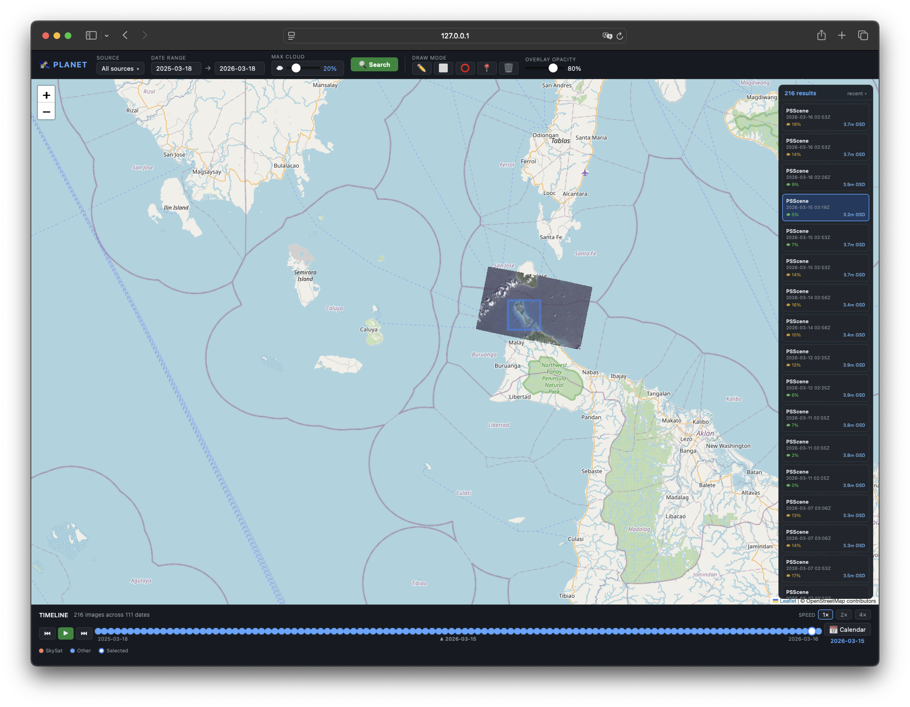
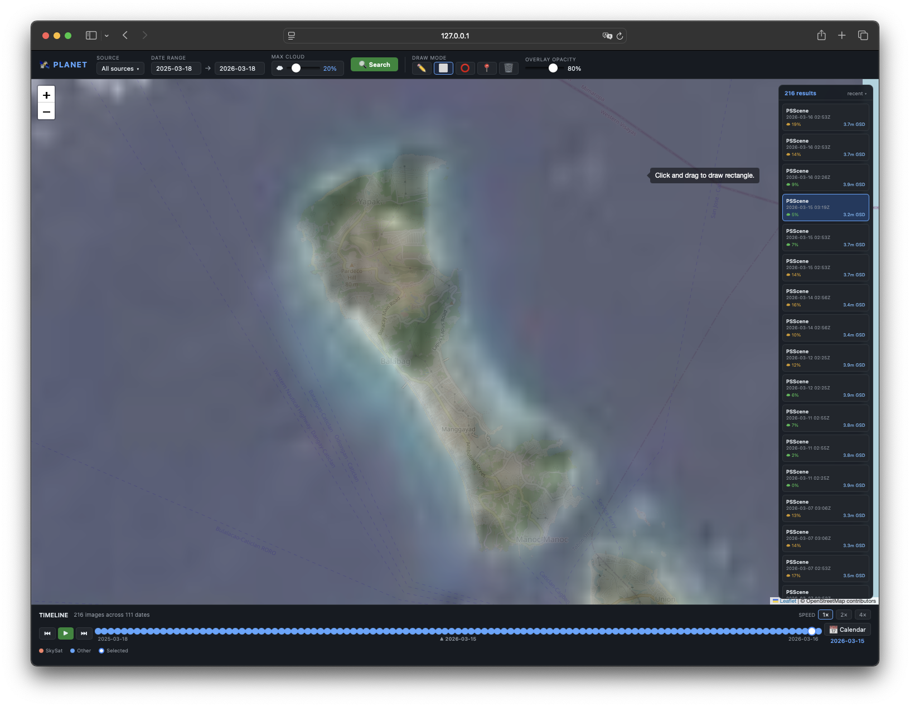
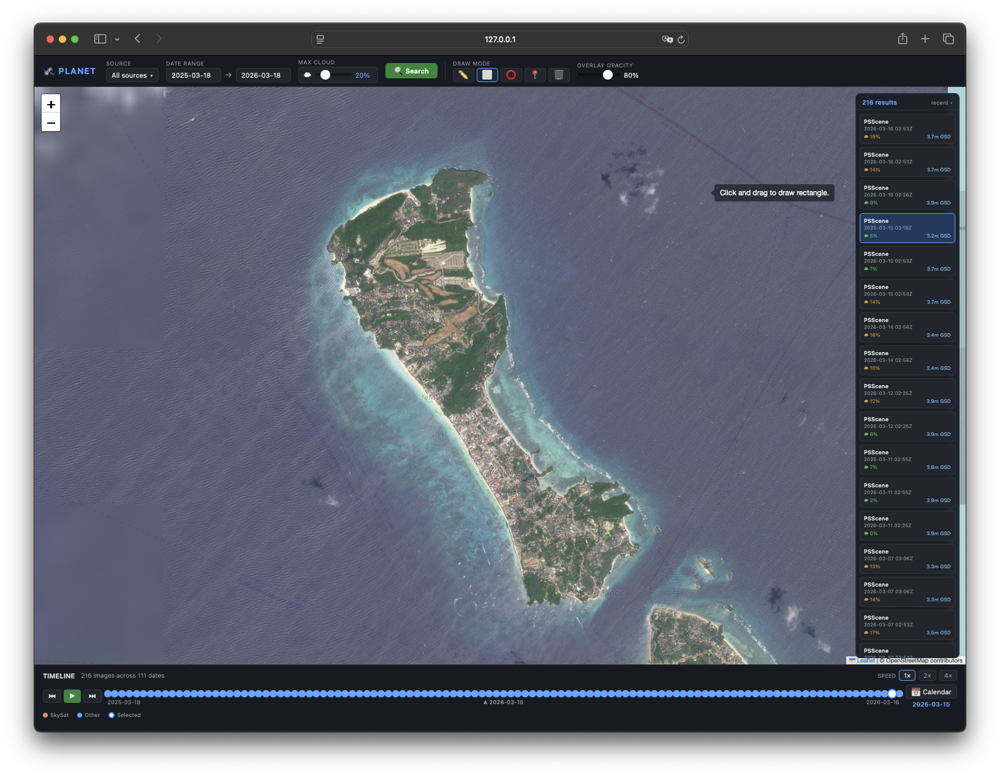

# orbit

OSINT satellite imagery tool — search, filter, and replay Planet imagery for geospatial intelligence and ground truth verification.



---

## What it does

Orbit is a local web app that lets you:

- **Select any area of interest** on a Leaflet map using polygon, rectangle, circle, or point+radius tools
- **Search Planet's imagery archive** across multiple sources (SkySat, PlanetScope, Sentinel-2, Landsat)
- **View and compare results** sorted by recency and resolution in a floating panel with thumbnails
- **Replay imagery over time** using a timeline slider with per-date dot markers, play/pause, speed control, and a calendar picker

Designed for OSINT, geospatial intelligence, ground truth verification, and change detection workflows. Runs entirely locally — no data leaves your machine except the API queries to Planet.

---

## Screenshots

### AOI selection — Persian Gulf / Strait of Hormuz


### Drawing a search area over the Oman coast


### Ship detection — zoomed satellite imagery

*PlanetScope imagery zoomed in to detect a vessel at sea*

### Satellite tile overlay — Papua New Guinea


### Island overview with imagery loaded


### High-detail island imagery with results panel


---

## Getting a Planet API key

1. Go to [planet.com](https://www.planet.com) and create a free account
2. Navigate to **Account Settings → API Keys**
3. Copy your API key
4. Check your subscription tier — free accounts include access to **PlanetScope (PSScene)** imagery; SkySat requires a paid subscription

> **Tip:** Planet offers a [free Education & Research program](https://www.planet.com/markets/education-and-research/) with expanded data access for qualifying users.

---

## Setup

### Requirements

- Python 3.9+
- A [Planet](https://www.planet.com) account with an API key

### Install

```bash
git clone https://github.com/seedon198/orbit.git
cd orbit

# Create and activate a virtual environment
python -m venv venv
source venv/bin/activate      # macOS/Linux
# venv\Scripts\activate       # Windows

# Install dependencies
pip install -r requirements.txt
```

### Configure

```bash
cp .env.example .env
```

Open `.env` and replace the placeholder with your Planet API key:

```
PLANET_API_KEY=your_planet_api_key_here
```

### Run

```bash
source venv/bin/activate
python app.py
```

Open **http://localhost:5000** in your browser.

---

## Usage

1. **Draw an AOI** — use the toolbar in the top bar to draw a polygon, rectangle, circle, or drop a point with a radius
2. **Set filters** — choose image sources, date range, and max cloud cover
3. **Click Search** — results appear in the floating panel on the right
4. **Click a result card** — loads the image as a tile overlay on the map
5. **Use the timeline** — scrub through dates, hit play to replay imagery over time, or use the calendar to jump to a specific date

---

## Image sources

| Source | Resolution | Notes |
|--------|-----------|-------|
| SkySat-Collect | ~0.5m | Highest resolution; requires paid subscription |
| PSScene | ~3m | Daily global coverage; available on free tier |
| Sentinel-2 | 10m | Free, ESA Copernicus program |
| Landsat 8 | 30m | Free, deep historical archive |

---

## Architecture

```
orbit/
├── app.py              # Flask app + route handlers
├── planet_client.py    # All Planet API communication
├── requirements.txt
├── .env                # API key (never committed)
├── .env.example        # Template for setup
├── templates/
│   └── index.html      # Single-page shell
└── static/
    ├── css/app.css
    └── js/
        ├── map.js       # Leaflet map + draw controls
        ├── search.js    # Top bar controls + search dispatch
        ├── results.js   # Floating results panel
        └── timeline.js  # Slider, play/pause, calendar
```

The Flask backend proxies all Planet API requests — the API key is **never** sent to the browser.

---

## Development

```bash
# Run tests
source venv/bin/activate
pytest tests/ -v
```

---

## License

MIT
